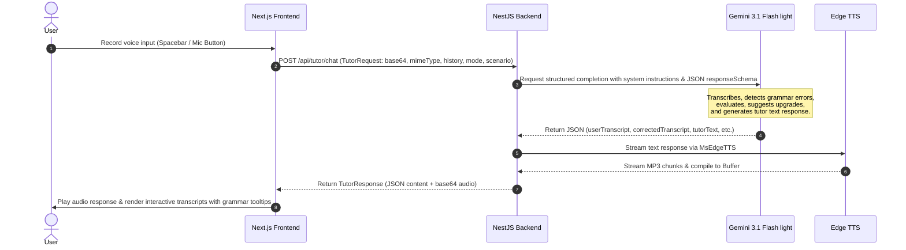

# 🎙️ Language Tutor: Real-Time AI-Powered Speaking Partner

> **Zero-cost, real-time AI-powered conversation practice & examination prep** (IELTS Speaking, Business English, Casual Conversation) that runs locally using your own free Gemini API key.

---

## 🗺️ Architectural Sequence Flow

Below is the execution flow demonstrating how real-time audio analysis, transcription, assessment, and speech synthesis are orchestrated across the stack:



---

## ✨ Features

- 🎯 **3 Specialized Modes**
  - **IELTS Speaking**: Simulates Parts 1, 2, and 3 of the speaking exam, adhering to official examiner scripts and scoring criteria.
  - **Business English**: Roleplays real-world scenarios (job interviews, client presentations, team meetings) with industry-specific vocabulary feedback.
  - **Casual Conversation**: Friendly, open-ended dialogues to build fluency and general speaking confidence.
- 🧠 **Structured AI Grading & Feedback**
  - Instant transcription via `gemini-3.1-flash-lite`.
  - Non-blocking inline corrections highlighting errors (original vs corrected) with detailed grammar explanations.
  - Lexical upgrade recommendations to expand vocabulary (e.g., suggesting "densely populated" over "crowded").
  - Pronunciation guidance for difficult or mispronounced words.
- 🔊 **Edge TTS Playback**: Natural-sounding Microsoft Edge voices (e.g., British English, American English, Australian English) synthesized server-side for fluid, hands-free conversation.
- 📊 **End-of-Session Analytics**: Comprehensive score reports featuring grade breakdowns (Fluency & Coherence, Lexical Resource, Grammar, Pronunciation), feedback summaries, common mistakes, and concrete revision recommendations.
- 💰 **BYO Key (Zero Hosting Cost)**: The app runs locally and integrates directly with the user's free Gemini API key stored in `localStorage` or server environment variables.

---

## 🏗️ Monorepo Architecture

This workspace is managed using [Nx](https://nx.dev) and [pnpm workspaces](https://pnpm.io/workspaces) to facilitate shared code and rapid local testing.

```
language-tutor/
├── apps/
│   ├── web/          # Next.js 16.2 (App Router) client with Tailwind CSS v4 & Base UI
│   └── api/          # NestJS v11 API Gateway calling Google GenAI & Edge TTS
├── libs/
│   └── shared-types/ # Shared DTOs and types utilized by both apps (shared-types/src/types.ts)
├── issues/           # Project issue tracking files
├── prd.md            # Complete Product Requirements Document
├── nx.json           # Nx workspace configuration
└── pnpm-workspace.yaml
```

---

## 🚀 Getting Started

### Prerequisites

- **Node.js**: v22+
- **pnpm**: v10+ (`npm install -g pnpm`)
- **API Key**: A free Gemini API key from [Google AI Studio](https://aistudio.google.com)

### Setup Instructions

1. **Clone the repository:**
   ```bash
   git clone https://github.com/rakib-siddiki/language-tutor.git
   cd language-tutor
   ```

2. **Install dependencies:**
   ```bash
   pnpm install
   ```

3. **Configure Environment Variables:**
   Create a `.env` file in the root directory (or copy `.env.example`):
   ```bash
   cp .env.example .env
   ```
   For the backend api server to start, configure environment variables in `apps/api/.env`:
   ```env
   PORT=3001
   CORS_ORIGIN=http://localhost:3000
   ```
   *Note: The Gemini API key is supplied by the frontend client (via `x-api-key` header from the browser Settings panel) to maintain the zero-cost architecture.*

4. **Launch Development Servers:**
   To spin up both Next.js and NestJS simultaneously under a unified log stream:
   ```bash
   pnpm dev
   ```
   Or launch services individually:
   - **Frontend client** (http://localhost:3000):
     ```bash
     pnpm dev:web
     ```
   - **Backend API** (http://localhost:3001/api):
     ```bash
     pnpm dev:api
     ```

---

## 🔧 CLI Reference

| Command | Action | Scope |
| :--- | :--- | :--- |
| `pnpm dev` | Starts frontend (Next.js) & backend (NestJS) concurrently | Global Monorepo |
| `pnpm dev:web` | Starts Next.js client on port `3000` | Frontend Client |
| `pnpm dev:api` | Starts NestJS API | Backend Gateway |
| `pnpm build:web` | Compiles Next.js optimized production build | Frontend Client |
| `pnpm build:api` | Compiles NestJS Nest build | Backend Gateway |
| `pnpm lint` | Runs eslint across all apps & libraries | Global Monorepo |
| `pnpm test` | Runs Jest test suite across all apps & libraries | Global Monorepo |
| `npx nx graph` | Generates interactive visualization of monorepo dependencies | Nx Workspace |

---

## 🌐 API Contract Reference

The backend exposes a prefix-scoped API route system. All requests and responses map directly to definitions inside the shared DTO library.

### 1. Health Status Check
Check API server status and connection health.
- **Endpoint**: `GET /api/health`
- **Response**:
  ```json
  {
    "status": "healthy",
    "timestamp": "2026-06-21T12:00:00.000Z"
  }
  ```

### 2. Process Chat Turn
Submits the recorded speech turn and fetches the tutor's evaluation and spoken response.
- **Endpoint**: `POST /api/tutor/chat`
- **Headers**:
  - `x-api-key`: `YOUR_GEMINI_API_KEY` (Required)
- **Request Body (`TutorRequest`)**:
  ```json
  {
    "audioBase64": "UklGRiSDAABXQVZFZm10IBIA...",
    "mimeType": "audio/webm;codecs=opus",
    "history": [
      { "role": "tutor", "text": "Hello, welcome to Part 1 of your IELTS exam. Let's discuss your hometown. Where are you from?" }
    ],
    "mode": "ielts",
    "scenario": "ielts-part-1",
    "voice": "en-GB-SoniaNeural"
  }
  ```
- **Response Body (`TutorResponse`)**:
  ```json
  {
    "userTranscript": "I am coming from Dhaka which is a crowded city.",
    "correctedTranscript": "I come from Dhaka, which is a crowded city.",
    "corrections": [
      {
        "original": "I am coming from Dhaka",
        "corrected": "I come from Dhaka",
        "explanation": "Use simple present tense to state permanent facts or place of origin rather than present continuous."
      }
    ],
    "vocabularySuggestions": [
      {
        "original": "crowded",
        "suggestion": "densely populated",
        "context": "Dhaka is a densely populated city."
      }
    ],
    "pronunciationTips": [
      { "word": "crowded", "tip": "Emphasize the diphthong /aʊ/ in the first syllable." }
    ],
    "tutorText": "Excellent response. What is your favorite place in Dhaka, and why?",
    "audioBase64": "//uQxAAMwUBAAAAA..."
  }
  ```

### 3. Evaluate Session
Terminates the session and performs an assessment of the student's fluency, vocabulary, grammar, and pronunciation.
- **Endpoint**: `POST /api/tutor/evaluate`
- **Headers**:
  - `x-api-key`: `YOUR_GEMINI_API_KEY` (Required)
- **Request Body**:
  ```json
  {
    "history": [
      { "role": "tutor", "text": "Where are you from?" },
      { "role": "user", "text": "I am coming from Dhaka." }
    ],
    "mode": "ielts",
    "scenario": "ielts-part-1"
  }
  ```
- **Response Body (`ScoreReport`)**:
  ```json
  {
    "fluencyScore": 6.5,
    "vocabularyScore": 6.0,
    "grammarScore": 5.5,
    "pronunciationScore": 6.0,
    "overallBand": 6.0,
    "feedbackSummary": "You spoke at a natural pace, but tense consistency needs attention. Try utilizing a wider variety of cohesive markers to transition between ideas.",
    "commonMistakes": [
      "Using present continuous to talk about general states",
      "Overusing general adjectives like 'nice' or 'good'"
    ],
    "exampleImprovements": [
      {
        "original": "I am coming from Dhaka.",
        "improved": "I come from Dhaka."
      }
    ]
  }
  ```

---

## ⚙️ Core Technical Details

### ⚡ Gemini 3.1 Flash Lite Integration
The backend utilizes the official `@google/genai` SDK to communicate with the `gemini-3.1-flash-lite` model. High accuracy and format conformance are achieved via:
1. **System Persona Prompting**: System instructions dynamically adjust depending on the user's selected mode (IELTS Examiner, Business Partner, or Casual Chat Companion).
2. **Strict Schema Constraints**: Enforcing JSON responses through `responseSchema` configurations prevents runtime parsing errors on JSON serialization.

### 🎙️ Audio Formats & Browser Compatibility
The frontend utilizes the HTML5 [MediaRecorder API](https://developer.mozilla.org/en-US/docs/Web/API/MediaRecorder) to record audio stream chunks.
- **WebM/Opus**: Default standard for Google Chrome, Firefox, and Chromium Edge.
- **MP4/AAC**: Default standard for Apple Safari (macOS & iOS).
The frontend detects the browser-supported container format at runtime and passes it to the backend via `TutorRequest.mimeType`.

### 🔊 Server-Side Text-To-Speech (TTS)
Audio synthesis is run through `msedge-tts`, connecting to Microsoft Edge's internal WebSocket Read-Aloud service.
- **Zero-Latency Streams**: Captures MP3 chunks, gathers them in memory, and converts them to base64 to avoid saving files on the server disk.
- **Fallback**: A client-side browser SpeechSynthesis backup is recommended if WebSockets are blocked by proxies.

---

## 🧪 Testing Guidelines

The codebase employs automated testing routines validating business logic at various layers.

### Testing Targets
1. **`TutorService` (NestJS)**: Checks integration behavior against the Google GenAI client and Mock Edge TTS.
2. **`AudioRecorder` (Next.js component)**: Verifies state machine transitions (idle ➔ recording ➔ processing ➔ finished).
3. **`ConversationPane` (Next.js component)**: Verifies interactive transcription, highlights, and grammar tooltip mouse-over interactions.
4. **`useSessionReducer` (Custom Hook)**: Confirms state management loops.

### Test Execution Command
To run all tests inside the monorepo:
```bash
pnpm test
```
To run tests for a specific workspace project:
```bash
npx nx test web
npx nx test api
```

---

## 📄 License & Standards

- **License**: MIT
- **Quality Standard Compliance**: Codebase conforms to standard Next.js, React, and NestJS development conventions as tracked in our [prd.md](file:///d:/workspace/Language%20Tutor/prd.md) requirements definition.
